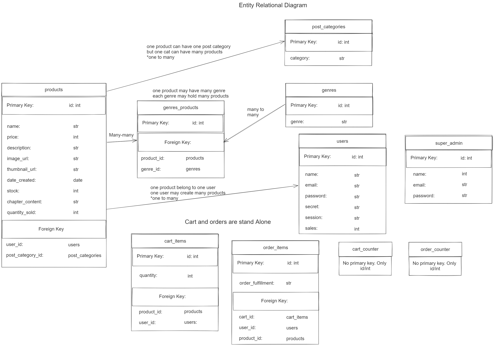

<h1> Documentation of Backend for Writers' base marketplace project </h1>

This is the link to this repo's frontend repository for Writers' base: <a href="https://github.com/Kern000/proj3-frontend"> Here </a>  
Live webpage of frontend is found: <a href="https://singular-jalebi-389fbc.netlify.app/#/"> Here </a>  

<h2> Entity Relational Diagram </h2>

<h3> Database Details </h3>
Relational Database was constructed using Bookshelf model with knex queries using mySql2, and later transitioned into Postgres. Relational Database presents a quick way to update multiple related tables in a single transaction.

<h3> Database Relationships: </h3>
One to Many Relationship  
<ul> 
 <li> Product to category </li>
</ul>
Many to Many Relationship  
<ul> 
 <li> Product to genres </li>
</ul>

<h2> Restful API endpoints showcase for frontend user </h2>

<h3> Landing Route displaying products </h3>
GET Route  
https://singular-jalebi-389fbc.netlify.app/#/

<h3> User login </h3>
GET Route  
https://singular-jalebi-389fbc.netlify.app/#/users/login

<h3> User Registration </h3>
GET Route  
https://singular-jalebi-389fbc.netlify.app/#/users/register

<h2> All routes below have authentication and authorization required </h2>
<h3> User add product </h3>
POST Route  
<a href="#"> https://singular-jalebi-389fbc.netlify.app/#/users/add-product/:userId </a>

<h3> User fetching his uploaded products </h3>
GET Route  
`https://singular-jalebi-389fbc.netlify.app/#/users/:productId/products`

<h2> Cart </h2>
<h3> User fetch cart </h3>
GET Route  
`https://singular-jalebi-389fbc.netlify.app/#/cart`

<h3> User add item to cart </h3>
POST Route  
`https://singular-jalebi-389fbc.netlify.app/#/cart/:product_id/add`

<h3> User update cart item quantity </h3>
POST Route  
`https://singular-jalebi-389fbc.netlify.app/#/cart/update-qty`

<h2> Checkout </h2>
POST Route  
`https://singular-jalebi-389fbc.netlify.app/#/checkout`

<h3> Stripe Webhook route </h3>
This route allows our site to receive confirmation of user payment 
POST Route  
`https://singular-jalebi-389fbc.netlify.app/#/checkout/process-payment`

<h3> User fetch his/her paid orders </h3>
GET Route  
`https://singular-jalebi-389fbc.netlify.app/#/orders`

<h2> Non-Restful API endpoints showcase for Admin user </h2>
<h3> Admin Login </h3>
POST Route  
https://writers-base-backend.onrender.com/admin/login

<h3> Admin fetch or search products from users and admin </h3>
GET Route  
https://writers-base-backend.onrender.com/admin/products

<h3> Admin update products </h3>
POST Route  
`https://writers-base-backend.onrender.com/admin/products/:productId/update`

<h3> Admin deleting a cart </h3>
POST Route  
`https://writers-base-backend.onrender.com/admin/carts/:cartId/delete-cart`

<h3> Admin updating an order </h3>
POST Route  
`https://writers-base-backend.onrender.com/admin/orders/update-quantity`

<h2> Testing </h2>
Testing is conducted on development frontend routes and localhost routes.

<h2> Deployment </h2>
Backend deployment is on render. Backend admin pages are also hosted on render.

